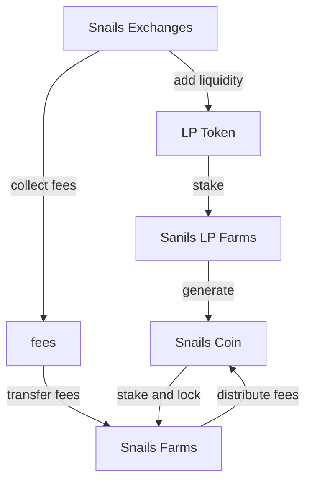

Install  Chrome [Mermaid extension](https://chrome.google.com/webstore/detail/github-%20-mermaid/goiiopgdnkogdbjmncgedmgpoajilohe?hl=en) to see the graph on github.

Draw graph by [Mermaid](https://mermaid-js.github.io/mermaid).

# Snails Finance Contracts

This mono repo contains the source code for the smart contracts of Snails Finance on [NEAR](https://near.org/).

## Contracts

| Contract        | Description            |
| --------------- | ---------------------- |
| test-token      | Test token contract    |
| snails_exchange | Main exchange contract |
| snails_farming  | Farm contract          |

## Snails Finance Architecture




## Development

1. Install `rustup` via https://rustup.rs/
2. Run the following:

```
rustup default stable
rustup target add wasm32-unknown-unknown
```

### Compiling

You can build release version by running below script or inside each contract folder:

```
./build_local.sh

cd snails_exchange/
./build_local.sh

cd snails_farming/
./build_local.sh

cd test-token/
./build_local.sh
```

wasm files are in below folder:

```
res/
```

### Testing

Contracts have unit tests and also integration tests using NEAR Simulation framework. You can inside each contract folder to run the test scripts

```
cd snails_exchange/
./build_test.sh

cd snails_farming/
./build_test.sh
```